# KKBOX Feature Catalog Mindmap

Mindmap dưới đây tóm tắt cấu trúc của feature catalog và cách các nhóm feature phục vụ dashboard BI.

```mermaid
mindmap
  root((KKBOX Feature Catalog))
    Phạm vi
      Notebook train_churn_pipeline.ipynb
      Chỉ đến bước trích xuất feature
      Phục vụ modeling
      Phục vụ BI dashboard
    Đầu ra
      train_features_all.parquet
      test_features_201704_full.parquet
      bi_feature_master.parquet
      train_features_bi_all.parquet
      test_features_bi_201704_full.parquet
      feature_columns.csv
      bi_dimension_columns.csv
    Làm sạch dữ liệu
      bd từ 15 đến 65
      total_secs cap 86400 giây mỗi ngày
      membership_expire_date sửa về transaction_date nếu bị ngược thời gian
      Gắn cờ invalid_expire_before_txn
      Chia cho 0 thay bằng giá trị mặc định
    Snapshot
      User x target_month
      Chọn giao dịch mốc hợp lệ cuối cùng
      expire_month bằng target_month
      is_cancel bằng 0
      transaction_month nhỏ hơn target_month
      Label churn trong 30 ngày sau hết hạn
    Nhóm feature
      Snapshot và churn label
        target_month
        is_churn
        expire_date
        transaction_date
        last_expire_month
        is_expiring_user
      Thanh toán hiện tại
        payment_method_id
        payment_plan_days
        plan_list_price
        actual_amount_paid
        is_auto_renew
        discount
        is_discount
        amt_per_day
        expected_renewal_amount
        discount_ratio
        payment_to_list_ratio
        days_to_expire
        remaining_plan_ratio
      Lịch sử giao dịch và churn
        last_1_is_churn đến last_5_is_churn
        churn_rate
        churn_count
        transaction_count
        historical_transaction_rows
        historical_paid_total
        historical_paid_mean
        historical_list_price_mean
        historical_cancel_count
        historical_cancel_rate
        historical_auto_renew_rate
        days_since_previous_transaction
        recent_churn_events
        weighted_recent_churn
      Aggregate user_logs tháng trước
        num_25 đến num_100 mean
        num_25 đến num_100 sum
        num_unq_mean
        num_unq_sum
        total_secs_mean
        total_secs_sum
        count
        last_log_date
        capped_log_count
      Hành vi nghe nhạc suy diễn
        secs_per_log
        unique_per_log
        num100_per_log
        listen_events_sum
        skip_events_sum
        weighted_completion_sum
        weighted_completion_per_log
        completion_ratio
        skip_ratio
        discovery_ratio
        replay_ratio
        avg_secs_per_unique
        secs_per_plan_day
        uniques_per_plan_day
        logs_per_plan_day
        secs_per_paid_amount
        days_since_last_listen
        capped_log_share
      Member và nhân khẩu học
        city
        bd
        age
        has_valid_age
        gender
        gender_profile
        registered_via
        registration_init_time
        registration_year month day
        membership_age_days
        tenure_months
      RFM
        rfm_recency_score
        rfm_frequency_score
        rfm_monetary_score
        rfm_total_score
        rfm_segment_code
        rfm_segment
      Segment semantic cho BI
        age_segment
        price_segment
        loyalty_segment
        active_segment
        skip_segment
        discovery_segment
        renewal_segment
        rfm_segment
        bi_segment_name
      Flags cho BI và simulation
        is_manual_renew
        high_skip_flag
        low_discovery_flag
        deal_hunter_flag
        free_trial_flag
        content_fatigue_flag
        auto_renew_discount_interaction
    Mapping BI
      Tab 1 Descriptive
        Total Expiring Users
        Historical Churn Rate
        Overall Median Survival
        Auto-Renew Rate
        Kaplan-Meier theo age gender activity skip
        Stacked Bar theo price loyalty active
        Scatter discovery_ratio và skip_ratio
      Tab 2 Predictive
        Input cho churn classification
        Input cho Cox
        Input cho CLTV
        Revenue at Risk
        Top Flight-Risk Segment
        Value vs Risk
      Tab 3 Prescriptive Simulation
        Chuyển manual sang auto-renew
        Upsell deal trial lên giá chuẩn
        Giảm skip ratio
        Dùng feature store làm đầu vào
    Giới hạn hiện tại
      Chưa có churn_probability
      Chưa có hazard_ratio
      Chưa có predicted_future_cltv
      Chưa có SHAP values
      skip_ratio là proxy
      discovery_ratio là proxy
```

## Gợi ý sử dụng

- Dùng mindmap này ở phần mở đầu khi thuyết trình về data pipeline hoặc feature store
- Nếu cần bản gọn hơn cho slide, có thể rút xuống còn 4 nhánh chính: `Làm sạch dữ liệu`, `Snapshot`, `Nhóm feature`, `Mapping BI`
- Nếu cần bản chi tiết hơn cho đồ án, có thể tách riêng mỗi nhóm feature thành một mindmap con
